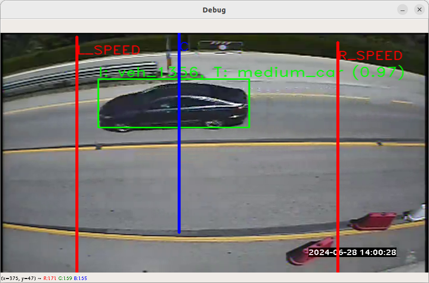

# Video-based Vehicle Counting System (VCS)



## Requirements

- Python 3.7;
- Official NVIDIA driver;
- CUDA packages.

### NVIDIA driver and CUDA packages installation

#### Clean up

- Open a terminal window and run the following commands to remove any NVIDIA/CUDA packages the system may already and that may cause a conflicts with newly installed ones:

```sh
sudo rm /etc/apt/sources.list.d/cuda*
sudo apt remove --autoremove nvidia-cuda-toolkit
sudo apt remove --autoremove nvidia-*
```

- Purge any remaining NVIDIA configuration files and associated dependencies that may have been installed with:

```sh
sudo apt-get purge nvidia*
sudo apt-get autoremove
sudo apt-get autoclean
```

- Remove any existing CUDA folders the system may have in **/user/local/**

```sh
sudo rm -rf /usr/local/cuda*
```

#### Installation

- Set CUDA PPA:

```sh
sudo apt update
sudo add-apt-repository ppa:graphics-drivers
sudo apt-key adv --fetch-keys http://developer.download.nvidia.com/compute/cuda/repos/<UBUNTU_VERSION>/x86_64/7fa2af80.pub
sudo bash -c 'echo "deb http://developer.download.nvidia.com/compute/cuda/repos/<UBUNTU_VERSION>/x86_64 /" > /etc/apt/sources.list.d/cuda.list'
sudo bash -c 'echo "deb http://developer.download.nvidia.com/compute/machine-learning/repos/<UBUNTU_VERSION>/x86_64 /" > /etc/apt/sources.list.d/cuda_learn.list'
```
Replace <UBUNTU_VERSION> with the proper version of the Ubuntu, ex. *ubuntu1804*.

And finally install the packages:

```sh
sudo apt update
sudo apt install cuda-<MAJOR_VERSION_NUMBER>-<SECONDARY_VERSION_NUMBER-number>
sudo apt install libcudnn7
```

- **OR** follow the steps from the official documentation page [here](https://developer.nvidia.com/cuda-downloads?target_os=Linux) on installation of the CUDA packages of the desired version

Also, Check out the CUDA installation guide for Linux [here](https://docs.nvidia.com/cuda/cuda-installation-guide-linux/index.html).

#### Add CUDA to PATH

After installing, we need to add CUDA to our PATH, so that the shell knows where to find CUDA. To edit our path, open up the ‘.profile’ file using *vim* or *nano*.

```sh
sudo vim ~/.profile
```

And add these lines to the end of the file:

```sh
# set PATH for cuda installation
if [ -d "/usr/local/cuda-<MAJOR_VERSION_NUMBER>.<SECONDARY_VERSION_NUMBER>/bin/" ]; then
    export PATH=/usr/local/cuda-<MAJOR_VERSION_NUMBER>.<SECONDARY_VERSION_NUMBER>/bin${PATH:+:${PATH}}
    export LD_LIBRARY_PATH=/usr/local/cuda-<MAJOR_VERSION_NUMBER>.<SECONDARY_VERSION_NUMBER>/lib64${LD_LIBRARY_PATH:+:${LD_LIBRARY_PATH}}
fi
```

Replace *\<MAJOR_VERSION_NUMBER\>* and *\<SECONDARY_VERSION_NUMBER\>* with appropriate **CUDA** version numbers.

#### Reboot

Reboot the system to make the changes take an effect.

```sh
sudo reboot
```

#### Final check

Check if the **NVIDIA** driver and the **CUDA** packages have been installed successfully.

- Check NVIDIA driver:

```sh
nvidia-smi
```

- Check CUDA:

```sh
nvcc --version
```

- Check CuDNN:

```sh
/sbin/ldconfig -N -v $(sed ‘s/:/ /’ <<< $LD_LIBRARY_PATH) 2>/dev/null | grep libcudnn
```

**NOTE:** CuDNN is not required for the successful run of the Vehicle Counting Software.

*Reference:* [https://medium.com/@stephengregory_69986/installing-cuda-10-1-on-ubuntu-20-04-e562a5e724a0](https://medium.com/@stephengregory_69986/installing-cuda-10-1-on-ubuntu-20-04-e562a5e724a0)

## Setup

- Clone this repo `git@github.com:Artem723/ivy.git`.
- Create a virtual environment:

```sh
python -m venv <PATH>
```

Use the virtual environment:

```sh
source <PATH>/bin/activate
```

\<PATH\> - is the place where the virtual environment and packages will be created and installed.

- Run `pip install -r requirements.txt` to install dependencies.

## Configuration

***TODO: Write about the configuration of .env file***

## Run

- Create _.env_ from _.env.example_ in the project root and edit as appropriate.
- Run `python -m  main`.

## Demo

Download [vcs_demo_data.zip](https://drive.google.com/open?id=1sUeZ0aXemC5y7qU60jH8gd0r9ysBYdf5) and unzip its contents in the [data directory](/data). It contains detection models and a sample video of a traffic scene.

## Test

```sh
python -m pytest
```

## Debug

By default, the VCS runs in "debug mode" which provides you a window to monitor the vehicle counting process. You can press the `s` key when the program is running to capture a screenshot and use `q` to quit.

## How it works

The vehicle counting system is made up of three main components: a detector, tracker and counter. The detector identifies vehicles in a given frame of video and returns a list of bounding boxes around the vehicles to the tracker. The tracker uses the bounding boxes to track the vehicles in subsequent frames. The detector is also used to update the trackers periodically to ensure that they are still tracking the vehicles correctly. The counter counts vehicles when they leave the frame or makes use of a counting line drawn across a road.

__PS:__ You can find out about how the vehicle counting system was built by checking out this article on my blog: <https://alphacoder.xyz/vehicle-counting/>.

## Dataset link

<https://ai.stanford.edu/~jkrause/cars/car_dataset.html>
<https://sites.google.com/view/visionlearning/databases/image-database-for-vehicle-recognition>
<https://public.roboflow.com/object-detection/vehicles-openimages/1/download>
<https://lionbridge.ai/datasets/250000-cars-top-10-free-vehicle-image-and-video-datasets-for-machine-learning/>
